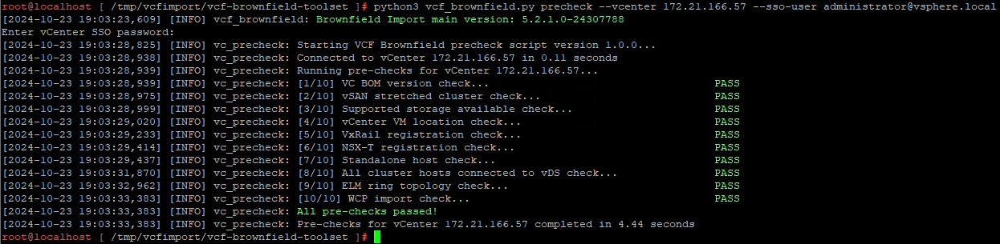

= VCF 가져오기 도구를 사용하여 vSphere 클러스터를 VCF 관리 도메인으로 변환
:allow-uri-read: 
:icons: font
:imagesdir: ../media/

[role="lead"]
VCF 가져오기 도구를 사용하여 기존 vSphere 8 클러스터를 VCF 5.2 관리 도메인으로 변환합니다.  vCenter 어플라이언스를 검증하고, SDDC 관리자를 배포하고, NSX 배포 사양을 만들고, 변환을 수행합니다.

Broadcom의 VMware에서 제공하는 VCF 가져오기 도구를 vCenter 어플라이언스와 SDDC 관리자 모두에서 사용하여 구성을 검증하고 vSphere 및 VCF 환경에 대한 변환 및 가져오기 서비스를 제공합니다.

필요한 경우 추가 지침에 대한 VMware 설명서가 참조됩니다.

== 1단계: VCF 가져오기 도구를 복사하고 사전 검사를 실행합니다.

vCenter 어플라이언스에서 VCF 가져오기 도구를 사용하여 vSphere 클러스터가 VCF 변환 또는 가져오기 프로세스에 적합한 상태인지 확인합니다.

.단계
. VMware 설명서의 지침에 따라 VCF 가져오기 도구를 대상 vCenter 어플라이언스에 복사합니다. https://techdocs.broadcom.com/us/en/vmware-cis/vcf/vcf-5-2-and-earlier/5-2/copy-the-vcf-import-tool-to-the-target-vcenter-appliance.html["VCF 가져오기 도구를 대상 vCenter Appliance에 복사합니다."] .
. 다음 명령을 사용하여 번들을 추출합니다.
+
[listing]
----
tar -xvf vcf-brownfield-import-<buildnumber>.tar.gz
----
. VMware 설명서의 지침에 따라 유효성 검사 사전 검사를 실행하세요. https://techdocs.broadcom.com/us/en/vmware-cis/vcf/vcf-5-2-and-earlier/5-2/run-a-precheck-on-the-target-vcenter-before-conversion.html["변환 전 대상 vCenter에서 사전 검사 실행"] .
. 다음 출력은 vCenter 어플라이언스가 사전 검사를 통과했음을 보여줍니다.
+

== 2단계: SDDC 관리자 배포 및 NSX 배포 사양 생성

VCF 관리 도메인으로 변환하려는 동일한 vSphere 클러스터에 SDDC Manager 어플라이언스를 배포한 다음, 변환 프로세스에 대한 NSX 배포 사양을 만듭니다.

.단계
. VMware 설명서의 지침에 따라 SDDC Manager 어플라이언스를 배포합니다. https://techdocs.broadcom.com/us/en/vmware-cis/vcf/vcf-5-2-and-earlier/5-2/deploy-the-sddc-manager-appliance-on-the-target-vcenter.html["대상 vCenter에 SDDC Manager Appliance 배포"] .
. VMware 설명서의 지침에 따라 SDDC Manager 인벤토리에 호스트를 추가합니다. https://techdocs.broadcom.com/us/en/vmware-cis/vcf/vcf-5-2-and-earlier/5-1/commission-hosts.html["위원회 호스트"] .
+
다음은 NSX 배포를 위한 JSON 파일의 예입니다.

+
[listing]
----
{
  "license_key": "xxxxx-xxxxx-xxxxx-xxxxx-xxxxx",
  "form_factor": "medium",
  "admin_password": "************************",
  "install_bundle_path": "/tmp/vcfimport/bundle-133764.zip",
  "cluster_ip": "172.21.166.72",
  "cluster_fqdn": "vcf-m02-nsx01.sddc.netapp.com",
  "manager_specs": [{
    "fqdn": "vcf-m02-nsx01a.sddc.netapp.com",
    "name": "vcf-m02-nsx01a",
    "ip_address": "172.21.166.73",
    "gateway": "172.21.166.1",
    "subnet_mask": "255.255.255.0"
  },
  {
    "fqdn": "vcf-m02-nsx01b.sddc.netapp.com",
    "name": "vcf-m02-nsx01b",
    "ip_address": "172.21.166.74",
    "gateway": "172.21.166.1",
    "subnet_mask": "255.255.255.0"
  },
  {
    "fqdn": "vcf-m02-nsx01c.sddc.netapp.com",
    "name": "vcf-m02-nsx01c",
    "ip_address": "172.21.166.75",
    "gateway": "172.21.166.1",
    "subnet_mask": "255.255.255.0"
  }]
}
----
. JSON 파일을 SDDC 관리자의 디렉토리에 복사합니다.

NOTE: 변환 또는 가져오기 작업에서 NSX Manager 클러스터를 배포하는 경우 NSX-VLAN 네트워킹이 사용됩니다.  NSX-VLAN 네트워킹 제한 사항에 대한 자세한 내용은 VMware 설명서를 참조하세요. https://techdocs.broadcom.com/fr/fr/vmware-cis/vcf/vcf-5-2-and-earlier/5-2/considerations-before-converting-or-importing-existing-vsphere-environments-into-vcf.html["기존 vSphere 환경을 VMware Cloud Foundation으로 변환하거나 가져오기 전 고려 사항"] .

== 3단계: SDDC 관리자에 소프트웨어 업로드

VMware 설명서의 지침에 따라 VCF 가져오기 도구 번들과 NSX 배포 번들을 SDDC 관리자에 업로드합니다. https://techdocs.broadcom.com/us/en/vmware-cis/vcf/vcf-5-2-and-earlier/5-2/seed-software-on-sddc-manager.html["SDDC 관리자 어플라이언스에 필요한 소프트웨어 업로드"] .

VCF 가져오기 도구와 NSX 배포 번들을 SDDC 관리자의 다음 디렉토리에 복사해야 합니다. `/home/vcf/vcfimport` .

== 4단계: vSphere 클러스터를 VCF 관리 도메인으로 변환

VMware 설명서의 지침에 따라 vSphere 클러스터를 VCF 관리 도메인으로 변환합니다. https://techdocs.broadcom.com/us/en/vmware-cis/vcf/vcf-5-2-and-earlier/5-2/import-workload-domain-into-sddc-manager-inventory.html["vSphere 환경을 SDDC 관리자 인벤토리로 변환하거나 가져오기"] .

다음 명령을 사용하여 vSphere 클러스터를 VCF 관리 도메인으로 변환하고 NSX 클러스터를 배포합니다.

[listing]
----
python3 vcf_brownfield.py convert --vcenter '<vcenter-fqdn>' --sso-user '<sso-user>' --domain-name '<wld-domain-name>' --nsx-deployment-spec-path '<nsx-deployment-json-spec-path>'
----
어디:

* `<vcenter-fqdn>`vCenter 서버의 정규화된 도메인 이름입니다.
* `<sso-user>`Single Sign-On 사용자 계정입니다
* `<wld-domain-name>`워크로드 도메인에 대한 원하는 이름입니다.
* `<nsx-deployment-json-spec-path>`2단계에서 생성된 NSX 배포 JSON 파일의 경로입니다.

TIP: 다음을 실행하여 사용 가능한 모든 VCF 가져오기 도구 기능을 검토할 수 있습니다. `python3 vcf_brownfield.py --help` 에서 `/home/vcf/vcf-import-package/vcf-brownfield-import-<version>/vcf-brownfield-toolset` 예배 규칙서.

== 5단계: VCF에 라이선싱 추가

변환을 완료한 후 VCF 환경에 라이선스를 추가합니다.

.단계
. SDDC 관리자 UI에 로그인합니다.
. 탐색 창에서 *관리 > 라이선싱*으로 이동합니다.
. *+ 라이선스 키*를 클릭하세요.
. 드롭다운 메뉴에서 제품을 선택하세요.
. 라이센스 키를 입력하세요.
. 라이센스에 대한 설명을 제공하세요.
. *추가*를 클릭하세요.
. 각 라이선스에 대해 이 단계를 반복합니다.

== 추가 정보

* VCF 가져오기 도구에 대한 자세한 내용은 VMware 설명서를 참조하세요.link:https://techdocs.broadcom.com/us/en/vmware-cis/vcf/vcf-5-2-and-earlier/5-2/map-for-administering-vcf-5-2/importing-existing-vsphere-environments-admin/vcf-import-tool-options-and-parameters-admin.html["VCF 가져오기 도구 옵션 및 매개변수"] .

